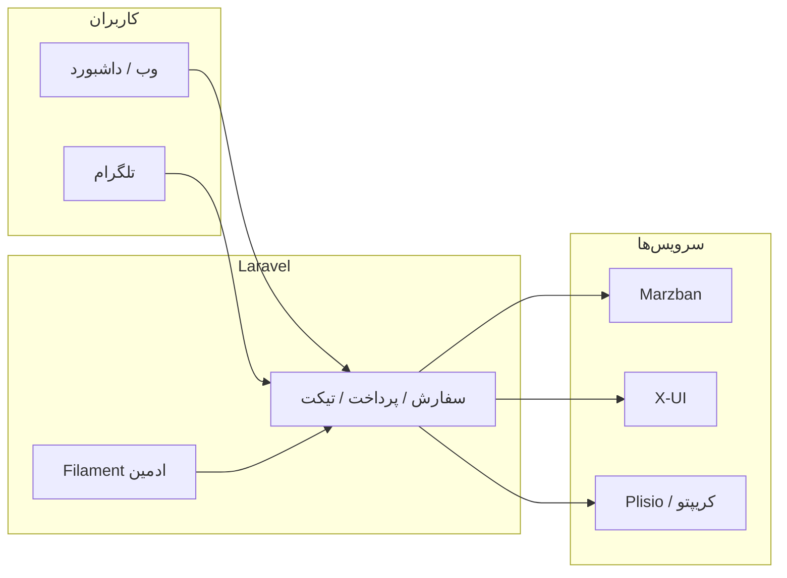

<div align="center">

# V2rayMarket

**فروشگاه و پنل مدیریت سرویس VPN** — اتصال به **Marzban** و **X-UI (Sanaei)**، پرداخت چندگانه، ربات تلگرام و پشتیبانی تیکتی.

[](https://www.php.net/)
[](https://laravel.com/)
[](https://filamentphp.com/)
[](https://opensource.org/licenses/MIT)

[نصب سریع](#-نصب-سریع) · [امکانات](#-فهرست-امکانات) · [پشتهٔ فنی](#-پشتهٔ-فنی) · [وب‌هوک‌ها](#-وب‌هوک‌ها)

</div>

---

## دربارهٔ پروژه

یک اپلیکیشن **Laravel** تمام‌عیار برای فروش پلن‌های VPN، مدیریت کاربران پنل، کیف پول داخلی، تخفیف، وبلاگ، سیستم معرفی و یکپارچگی عمیق با **تلگرام**. رابط ادمین بر پایهٔ **Filament 3** است؛ بخش کاربران با **Breeze** و تم‌های چندگانه.

> این مخزن [**V2rayMarket**](https://github.com/letmefind/V2rayMarket) نسخهٔ توسعه‌یافتهٔ [**VPNMarket**](https://github.com/arvinvahed/VPNMarket) است. برای اعتبارسنجی و لایسنس پایه، حتماً به مخزن upstream مراجعه کنید.

---

## فهرست امکانات

<details open>
<summary><strong>۱. پنل ادمین (Filament)</strong></summary>

| بخش | توضیح |
|-----|--------|
| **داشبورد** | ویجت اطلاعات و آمار کلی |
| **کاربران** | مدیریت، موجودی، نقش ادمین، اتصال تلگرام |
| **سفارشات** | فیلتر منبع (وب/تلگرام)، رسید کارت، کریپتو دستی، **تأیید و اجرا**، حذف |
| **پلن‌ها** | قیمت، مدت، حجم، فعال/غیرفعال |
| **اینباندها** | همگام با X-UI برای ساخت لینک |
| **کدهای تخفیف** | درصد/مبلغ، محدودیت استفاده |
| **پخش تلگرام** | ارسال پیام انبوه به کاربران ربات |
| **تنظیمات تم (ThemeSettings)** | قالب سایت، ورود، **Marzban / X-UI**، **پرداخت** (کارت، Plisio، USDT/USDC دستی)، **ربات تلگرام**، دعوت از دوستان، رفر DNS و … |
| **تیکت** (ماژول) | مشاهده، پاسخ، بستن تیکت |
| **وبلاگ** (ماژول) | دسته و پست |
| **معرف** (ماژول) | ردیابی دعوت‌ها |
| **تنظیمات ربات** (ماژول) | پیام خوش‌آمد و استارت |

</details>

<details open>
<summary><strong>۲. فروش و سفارش (وب)</strong></summary>

- انتخاب پلن، اعمال **کد تخفیف**، فاکتور و پرداخت
- **کیف پول** داخلی و شارژ از طریق همان مسیرهای پرداخت
- **تمدید سرویس** برای سفارش‌های فعال
- صفحات پرداخت: کارت به کارت (آپلود رسید)، کیف پول، **Plisio**، **USDT/USDC دستی** (انتخاب شبکه، آدرس ولت، ثبت TxID / تصویر)
- نمایش مبلغ کریپتو با **تعداد اعشار قابل تنظیم** از پنل (۰–۸ رقم)

</details>

<details open>
<summary><strong>۳. اتصال به پنل VPN</strong></summary>

- **Marzban**: ساخت/به‌روزرسانی کاربر، لینک سابسکریپشن
- **X-UI (Sanaei)**: کلاینت روی اینباند پیش‌فرض، لینک **single** یا **subscription**، تمدید با حفظ UUID/subId
- پشتیبانی از تنظیمات پیشرفتهٔ لینک (TLS، Reality، DNS DoH/DoT در سناریوهای پشتیبانی‌شده در کد)

</details>

<details open>
<summary><strong>۴. پرداخت و درگاه‌ها</strong></summary>

| روش | توضیح |
|-----|--------|
| **کارت به کارت** | شماره کارت، راهنما، آپلود رسید — **تأیید دستی** ادمین (وب یا تلگرام) |
| **کیف پول** | کسر موجودی و تکمیل سفارش |
| **Plisio** | فاکتور کریپتو، وب‌هوک، تکمیل خودکار با `FulfillOrderAfterPaymentAction` |
| **USDT / USDC دستی** | نرخ تومانی، آدرس‌های ERC20/BEP20، اعلان به ادمین، تأیید از پنل یا **تلگرام** |
| **NowPayments** | مسیر وب‌هوک در پروژه (`/webhooks/nowpayments`) — در صورت فعال‌سازی در تنظیمات |

</details>

<details open>
<summary><strong>۵. ربات تلگرام</strong></summary>

- منوی اصلی: خرید، سرویس‌های من، کیف پول، تراکنش‌ها، پشتیبانی، دعوت، آموزش، **اکانت تست**
- خرید پلن با انتخاب نام کاربری؛ پشتیبانی از **چند سرور / لوکیشن** (در صورت نصب ماژول MultiServer در نسخه‌های دارای آن)
- پرداخت از ربات: کیف پول، کارت، Plisio، USDT/USDC دستی
- تمدید سرویس از ربات
- **اجبار عضویت کانال** (قابل روشن/خاموش + لیست کانال‌ها)
- **دعوت با لینک** و هدیه خوش‌آمد (قابل تنظیم)
- تیکت: باز کردن تیکت، پاسخ، بستن — رویدادها به **نوتیفیکیشن داخل سایت** و تلگرام کاربر
- **چت آی‌دی ادمین**:
  - اعلان **رسید کارت** و **کریپتو دستی** با دکمه‌های **تأیید پرداخت** / **لغو سفارش** (امضای امن callback)
  - دستور **`/pending`** (و مترادف‌ها) برای لیست سفارش‌های معلق با همان دکمه‌ها
  - **تیکت جدید** و **پیام جدید مشتری** با دکمهٔ **«پاسخ در تلگرام»**؛ ارسال متن پاسخ در چت ادمین (نیاز به حداقل یک کاربر `is_admin` در دیتابیس)
- پیام‌های پنل ادمین به کاربران خاص (از طریق کد موجود در کنترلر ربات)

</details>

<details open>
<summary><strong>۶. تیکتینگ (ماژول Ticketing)</strong></summary>

- ایجاد و پیگیری تیکت از **وب** (داشبورد کاربر) و **ربات**
- پاسخ ادمین از **Filament** یا **تلگرام** (با ثبت پاسخ به نام اولین کاربر ادمین)
- اعلان تلگرام به کاربر هنگام پاسخ ادمین (`SendTelegramReplyNotification`)

</details>

<details open>
<summary><strong>۷. وبلاگ (ماژول Blog)</strong></summary>

- دسته‌بندی و پست
- مدیریت کامل در Filament
- مسیرهای وب عمومی (طبق `Modules/Blog`)

</details>

<details open>
<summary><strong>۸. سیستم معرفی (ماژول Referral)</strong></summary>

- لینک دعوت اختصاصی کاربر
- ثبت معرف هنگام `/start` با پارامتر
- هدیه خوش‌آمد قابل تنظیم در ThemeSettings
- منابع Filament برای مدیریت/مشاهده

</details>

<details open>
<summary><strong>۹. تجربهٔ کاربری سایت</strong></summary>

- چند **تم** ظاهری (مثلاً dragon، cyberpunk، arcane، rocket) از تنظیمات
- **RTL** و ترجمهٔ فارسی (`resources/lang/fa`)
- داشبورد کاربر: سفارش‌ها، کیف پول، تیکت، نوتیفیکیشن
- فاکتور و مسیر پرداخت یکپارچه

</details>

<details open>
<summary><strong>۱۰. امنیت و زیرساخت</strong></summary>

- احراز هویت Breeze، CSRF، middleware استاندارد Laravel
- امضای وب‌هوک Plisio
- callbackهای حساس ادمین در تلگرام با **HMAC** (`APP_KEY`)
- ذخیرهٔ فایل‌های عمومی در `storage` با `storage:link`

</details>

---

## پشتهٔ فنی

| لایه | فناوری |
|------|--------|
| زبان | PHP **^8.3** |
| فریمورک | **Laravel 12** |
| ادمین | **Filament 3.2** |
| ماژول‌ها | **nwidart/laravel-modules** |
| ربات | **irazasyed/telegram-bot-sdk** |
| فرانت | **Vite**، **Tailwind**، Alpine (طبق Breeze) |
| QR | **simple-qrcode** |
| تست | **Pest** |

---

## ماژول‌های Laravel

| ماژول | نقش |
|--------|-----|
| `TelegramBot` | وب‌هوک، منطق ربات، لیسنرهای تیکت/سفارش |
| `Ticketing` | مدل تیکت، رویدادها، Filament، مسیرهای وب |
| `Blog` | پست و دسته |
| `Referral` | معرفی و دعوت |

---

## وب‌هوک‌ها

| مسیر | کاربرد |
|------|--------|
| `POST /webhooks/telegram` | به‌روزرسانی‌های ربات تلگرام |
| `POST /webhooks/plisio` | تأیید پرداخت Plisio |
| `POST /webhooks/nowpayments` | تأیید NowPayments (در صورت استفاده) |

> آدرس‌ها باید با **HTTPS** در اینترنت در دسترس باشند.

---

## نصب سریع

```bash
git clone https://github.com/letmefind/V2rayMarket.git
cd V2rayMarket
cp .env.example .env
composer install
php artisan key:generate
php artisan migrate --seed
npm install && npm run build
php artisan storage:link
```

سپس در `.env` و در **پنل ادمین → تنظیمات تم**: دیتابیس، `APP_URL`، Marzban/X-UI، تلگرام، درگاه‌ها و کارت را تکمیل کنید.

### نصب یک‌خطی (Ubuntu)

```bash
wget -O install.sh https://raw.githubusercontent.com/letmefind/V2rayMarket/main/install.sh && sudo bash install.sh
```

برای کلون از **upstream** اصلی، مقدار `GITHUB_REPO` داخل `install.sh` را به `https://github.com/arvinvahed/VPNMarket.git` تغییر دهید.

---

## آپدیت پس از استقرار

```bash
cd /path/to/V2rayMarket
git pull origin main
composer install --no-dev --optimize-autoloader
php artisan migrate --force
npm ci && npm run build
php artisan optimize:clear
```

---

## ساختار کلی (نمای بالا)



---

## منبع، فورک و لایسنس

| | لینک |
|---|------|
| **Upstream (پایه)** | [github.com/arvinvahed/VPNMarket](https://github.com/arvinvahed/VPNMarket) |
| **این مخزن** | [github.com/letmefind/V2rayMarket](https://github.com/letmefind/V2rayMarket) |

مجوز پروژهٔ پایه طبق سنت **MIT** است؛ برای متن دقیق، مخزن upstream را ببینید.

---

<div align="center">

**ساخته شده با Laravel و جامعهٔ متن‌باز**

</div>
